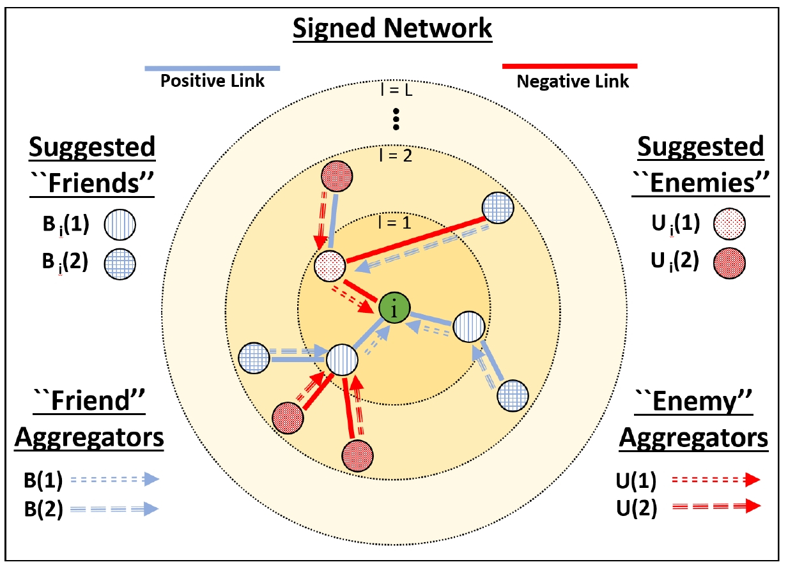
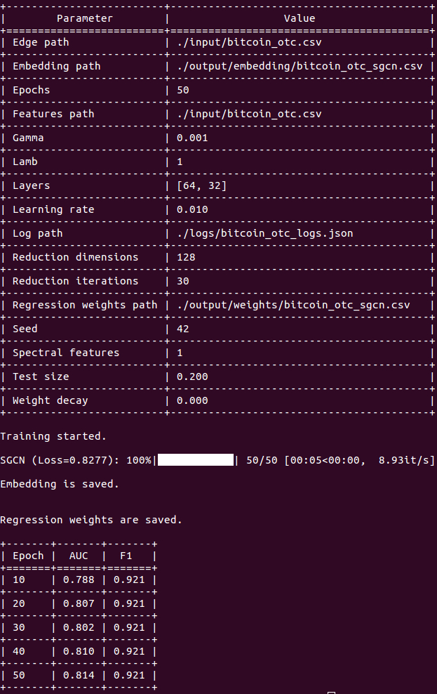

SGCN
============================================
[](https://arxiv.org/abs/1808.06354) [](https://github.com/benedekrozemberczki/SGCN/archive/master.zip)
 [](https://codebeat.co/projects/github-com-benedekrozemberczki-sgcn-master)⠀[](https://twitter.com/intent/follow?screen_name=benrozemberczki)
  
A PyTorch implementation of **Signed Graph Convolutional Network (ICDM 2018)**.

<div style="text-align:center"></div>

### Abstract
<p align="justify">
Due to the fact much of today's data can be represented as graphs, there has been a demand for generalizing neural network models for graph data. One recent direction that has shown fruitful results, and therefore growing interest, is the usage of graph convolutional neural networks (GCNs). They have been shown to provide a significant improvement on a wide range of tasks in network analysis, one of which being node representation learning. The task of learning low-dimensional node representations has shown to increase performance on a plethora of other tasks from link prediction and node classification, to community detection and visualization. Simultaneously, signed networks (or graphs having both positive and negative links) have become ubiquitous with the growing popularity of social media. However, since previous GCN models have primarily focused on unsigned networks (or graphs consisting of only positive links), it is unclear how they could be applied to signed networks due to the challenges presented by negative links. The primary challenges are based on negative links having not only a different semantic meaning as compared to positive links, but their principles are inherently different and they form complex relations with positive links. Therefore we propose a dedicated and principled effort that utilizes balance theory to correctly aggregate and propagate the information across layers of a signed GCN model. We perform empirical experiments comparing our proposed signed GCN against state-of-the-art baselines for learning node representations in signed networks. More specifically, our experiments are performed on four real-world datasets for the classical link sign prediction problem that is commonly used as the benchmark for signed network embeddings algorithms. </p>

This repository provides an implementation for SGCN as described in the paper:

> Signed Graph Convolutional Network.
> Tyler Derr, Yao Ma, and Jiliang Tang
> ICDM, 2018.
> [[Paper]](https://arxiv.org/abs/1808.06354)

The original implementation is available [[here]](https://www.cse.msu.edu/~derrtyle/code/SGCN.zip) and SGCN is also available in [[PyTorch Geometric]](https://github.com/rusty1s/pytorch_geometric).

### Requirements

The codebase is implemented in Python 3.5.2. package versions used for development are just below.
```
networkx           2.4
tqdm               4.28.1
numpy              1.15.4
pandas             0.23.4
texttable          1.5.0
scipy              1.1.0
argparse           1.1.0
sklearn            0.20.0
torch             1.1.0
torch-scatter     1.4.0
torch-sparse      0.4.3
torch-cluster     1.4.5
torch-geometric   1.3.2
torchvision       0.3.0
```
### Datasets
<p align="justify">
The code takes an input graph in a csv file. Every row indicates an edge between two nodes separated by a comma. The first row is a header. Nodes should be indexed starting with 0. Sample graphs for the `Bitcoin Alpha`  and `Bitcoin OTC` graphs are included in the  `input/` directory. The structure of the edge dataset is the following:
</p>

| **NODE ID 1**| **NODE ID 2** | **Sign** | 
| --- | --- | --- |
| 0 | 3 |-1 |
| 1 | 1 |1 |
| 2 | 2 |1 |
| 3 | 1 |-1 |
| ... | ... |... |
| n | 9 |-1 |

<p align="justify">
An attributed dataset for an `Erdos-Renyi` graph is also included in the input folder. **The node feature dataset rows are sorted by ID increasing**. The structure of the features csv has to be the following:
</p>

| **Feature 1** | **Feature 2** | **Feature 3** |...| **Feature d** |
| --- | --- | --- | --- |--- |
|  3 |0 |1.37 |... |1 |
|  1 |1 |2.54 |... |-11 |
| 2 |0 |1.08 |... |-12 |
| 1 |1 |1.22 |... |-4 |
| . ... |... |... |... |... |
|  5 |0 |2.47 |... |21 |

### Options
<p align="justify">
Learning an embedding is handled by the `src/main.py` script which provides the following command line arguments.
</p>
#### Input and output options

```
  --edge-path                STR    Input graph path.          Default is `input/bitcoin_otc.csv`.
  --features-path            STR    Features path.             Default is `input/bitcoin_otc.csv`.
  --embedding-path           STR    Embedding path.            Default is `output/embedding/bitcoin_otc_sgcn.csv`.
  --regression-weights-path  STR    Regression weights path.   Default is `output/weights/bitcoin_otc_sgcn.csv`.
  --log-path                 STR    Log path.                  Default is `logs/bitcoin_otc_logs.json`.  
```

#### Model options

```
  --epochs                INT         Number of SGCN training epochs.      Default is 100. 
  --reduction-iterations  INT         Number of SVD epochs.                Default is 128.
  --reduction-dimensions  INT         SVD dimensions.                      Default is 30.
  --seed                  INT         Random seed value.                   Default is 42.
  --lamb                  FLOAT       Embedding regularization parameter.  Default is 1.0.
  --test-size             FLOAT       Test ratio.                          Default is 0.2.  
  --learning-rate         FLOAT       Learning rate.                       Default is 0.001.  
  --weight-decay          FLOAT       Weight decay.                        Default is 10^-5. 
  --layers                LST         Layer sizes in model.                Default is [64, 32].
  --spectral-features     BOOL        Layer sizes in autoencoder model.    Default is True
  --general-features      BOOL        Loss calculation for the model.      Sets spectral features to False.  
```

### Examples

The following commands learn a node embedding, regression weights and write the embedding to disk. The node representations are ordered by the ID. The layer sizes can be set manually.

Training an SGCN model on the default dataset. Saving the embedding, regression weights and logs at default paths.
```
python src/main.py
```
<p align="center">

</p>

Creating an SGCN model of the default dataset with a 96-64-32 architecture.
```
python src/main.py --layers 96 64 32
```
Creating a single layer SGCN model with 32 features.
```
python src/main.py --layers 32
```
Creating a model with some custom learning rate and epoch number.
```
python src/main.py --learning-rate 0.001 --epochs 200
```
Training a model on another dataset with features present - a signed `Erdos-Renyi` graph. Saving the weights, output and logs in a custom folder.
```
python src/main.py --general-features --edge-path input/erdos_renyi_edges.csv --features-path input/erdos_renyi_features.csv --embedding-path output/embedding/erdos_renyi.csv --regression-weights-path output/weights/erdos_renyi.csv --log-path logs/erdos_renyi.json
```

--------------------------------------------------------------------------------

**License**

- [GNU](https://github.com/benedekrozemberczki/SGCN/blob/master/LICENSE)
